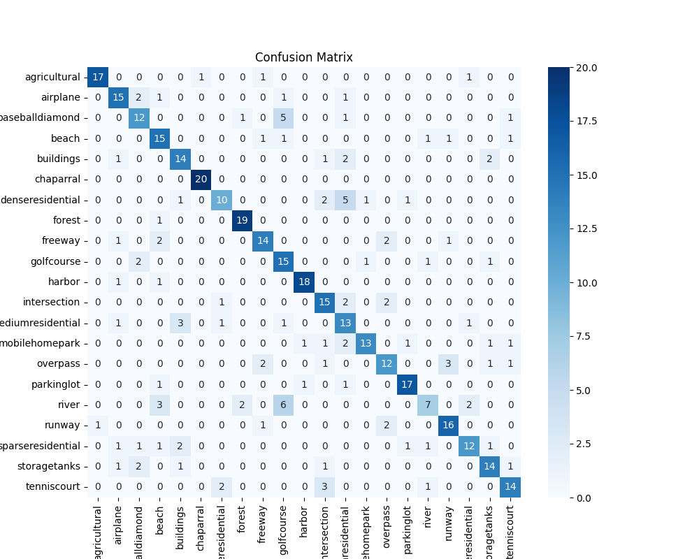

# Scene Recognition with MLPs on UCM Dataset

## Project Overview

This project implements two approaches for scene recognition using the UCM (UC Merced Land Use) dataset. The objective is to train a three-layer Multi-Layer Perceptron (MLP) for image classification, experimenting with different representations of image features.

### Part 1: Bag of Words Features with MLP
- **Task**: Using the Bag of Words (BoW) features derived from the UCM dataset, a three-layer MLP is built to classify the images. The model is trained to predict scene categories.
- **Steps**:
  1. **Feature Extraction**: Bag of Words (BoW) features are extracted from the UCM images using pre-trained models (like SIFT, ORB, or other feature descriptors).
  2. **MLP Model**: The features are fed into a three-layer MLP with configurable hidden layers and activation functions to predict the class of the scene.
  3. **Hyperparameter Tuning**: Experimentation with the number of nodes in hidden layers and activation functions like ReLU or LeakyReLU to optimize performance.
  
### Part 2: Image Downscaling and Linearization for MLP
- **Task**: Each image from the UCM dataset is downscaled to 72x72 pixels, linearized (flattened into a one-dimensional vector), and then fed into a three-layer MLP for classification.
- **Steps**:
  1. **Image Preprocessing**: Resize each image in the UCM dataset to 72x72 pixels and convert them to grayscale. Each image is then flattened into a 1D array to form a feature vector.
  2. **MLP Model**: The flattened image data is fed into a three-layer MLP for scene classification. Hyperparameters like the number of nodes in the hidden layers and the activation function are adjusted to achieve optimal accuracy.

## Dependencies

Ensure the following dependencies are installed:

- `torch`
- `torchvision`
- `numpy`
- `scikit-learn`
- `matplotlib`
- `PIL` or `opencv` for image manipulation

Install them using pip if necessary:

```bash
pip install torch torchvision numpy scikit-learn matplotlib pillow opencv-python
```

## Usage

### Part 1: Bag of Words Features with MLP

1. **Prepare the Data**: Load the precomputed Bag of Words features for training, validation, and testing.
   - Load the features using `pickle`.
   
2. **Train the MLP**:
   Run the following command to train the model on the extracted features:

   ```bash
   python bag_of_words_to_MLP.py
   ```

   The script will train the MLP model using the Bag of Words features, print loss and accuracy for each epoch, and save the model to `mlp_scene_recognition.pth`.

### Part 2: Image Downscaling and Linearization for MLP

1. **Preprocess Images**: Resize the images to 72x72 pixels and flatten them into 1D vectors.

2. **Train the MLP**:
   Run the following command to train the model on the resized and linearized images:

   ```bash
   python MLP.py
   ```

   This will train the MLP model using the downscaled and linearized images, print loss and accuracy, and save the model to `mlp_scene_recognition.pth`.

## Hyperparameters

- **Hidden Layer Sizes**: Experiment with different sizes for the hidden layers. The default configuration is `128` nodes in the first hidden layer and `64` nodes in the second hidden layer.
- **Activation Function**: ReLU is used by default. You can experiment with other activation functions like LeakyReLU or Sigmoid.
- **Learning Rate**: Default is `0.001`. You may adjust based on the observed performance.

## Results

- The model will output training and validation loss and accuracy after each epoch.
- The final trained model weights will be saved as `mlp_scene_recognition.pth`.
- Optionally, the confusion matrix for the test set is generated to provide insight into model performance for each class.


