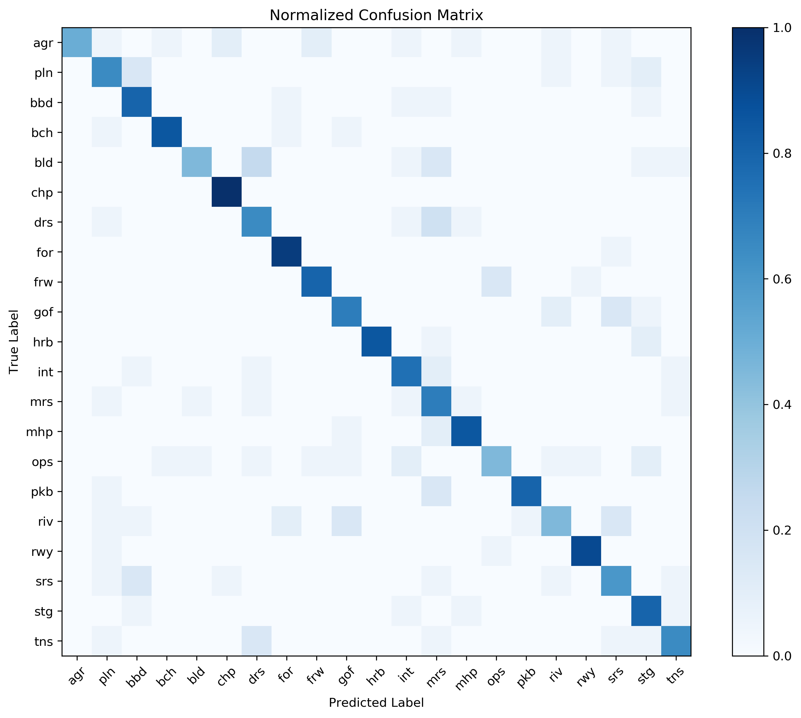
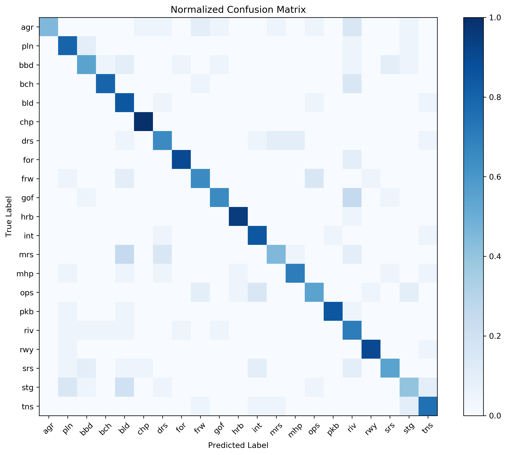
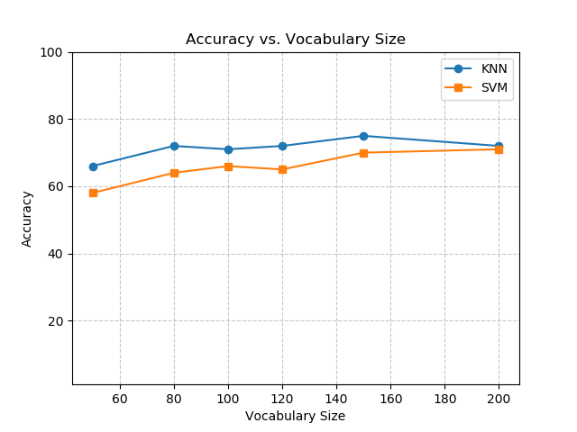
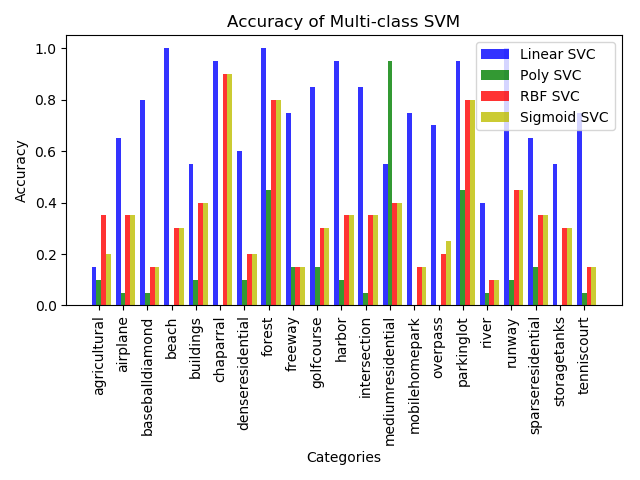
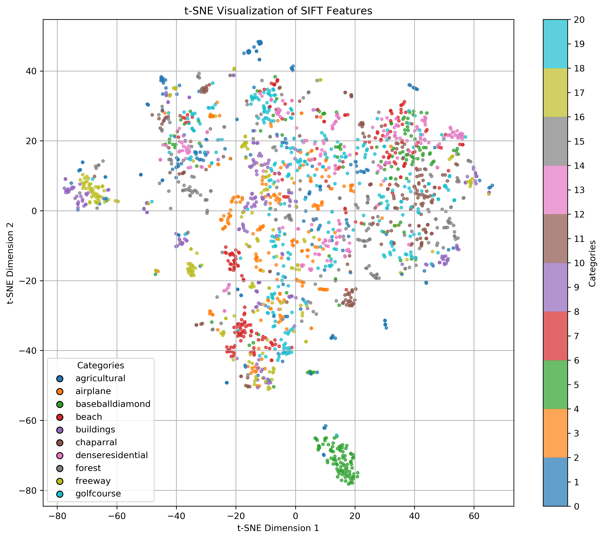
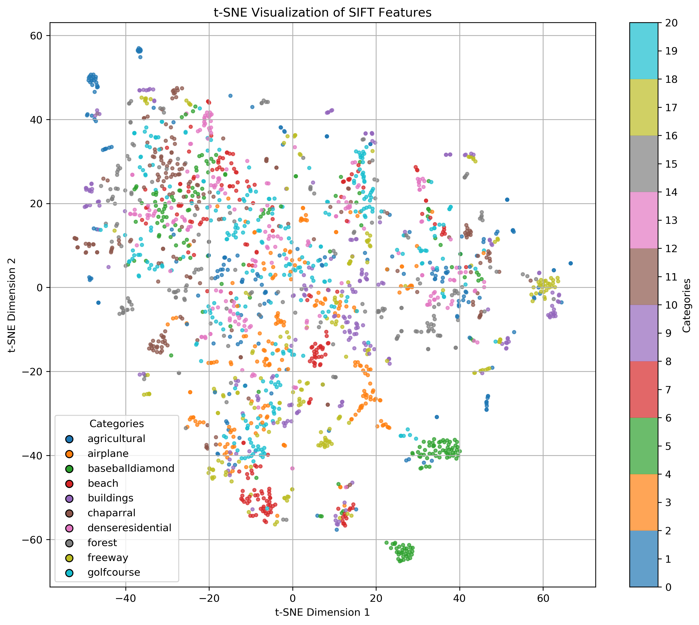
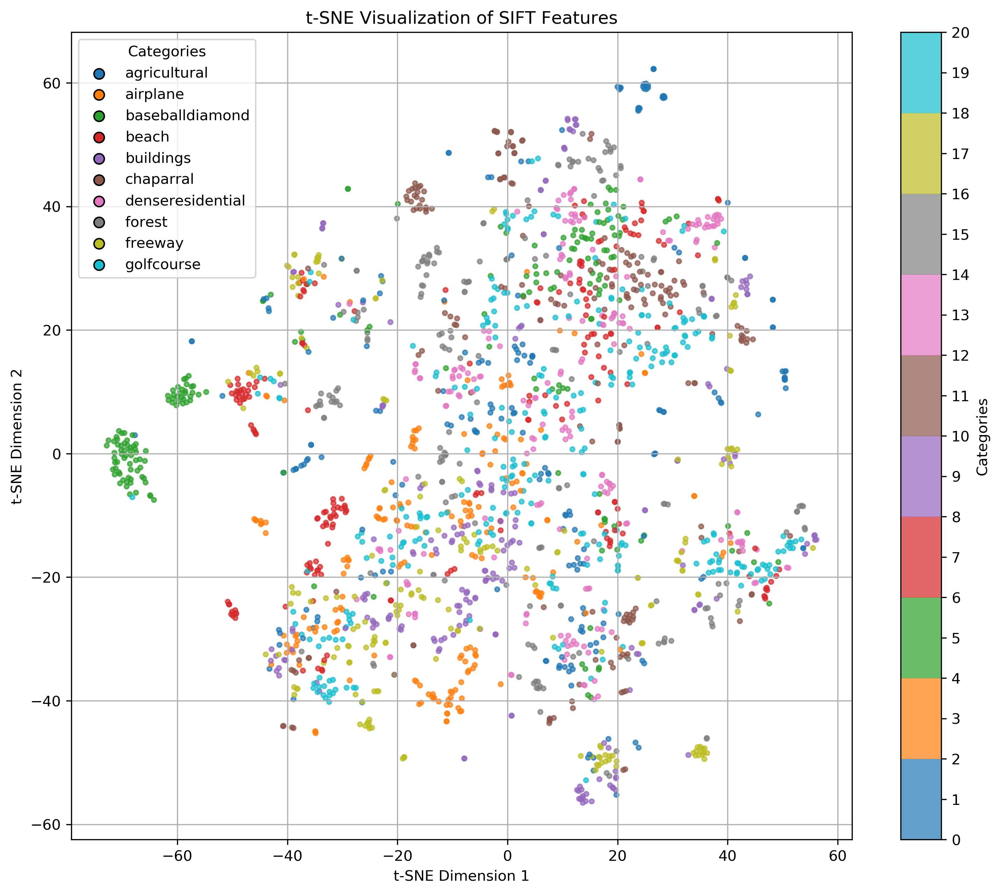
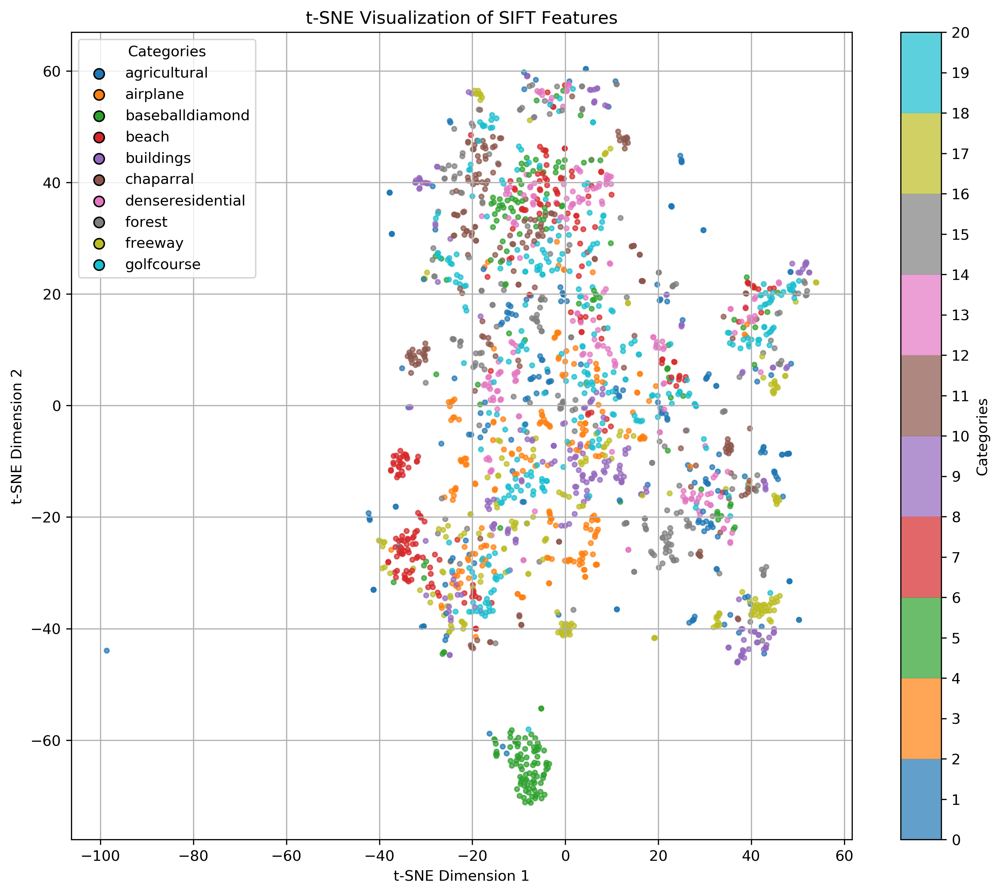
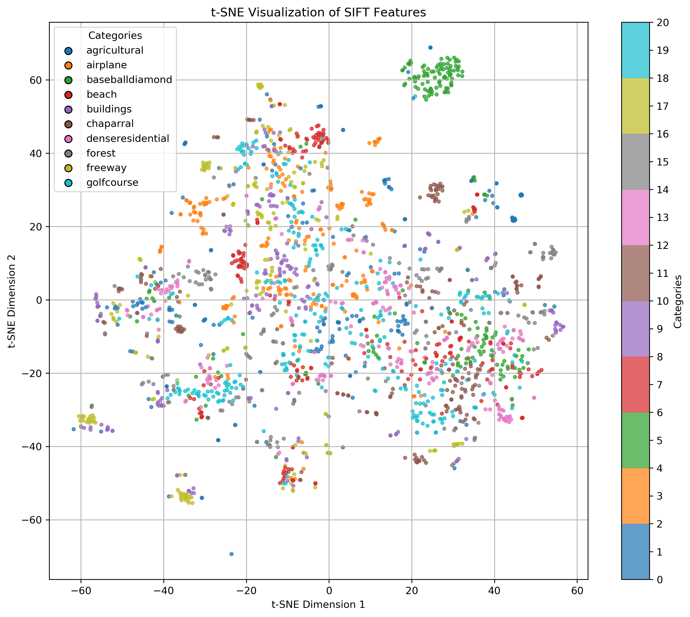

# Scene Recognition with Bag-of-Words on UC Merced Dataset

This project modifies the original codebase [Scene Recognition with Bag-of-Words](https://github.com/lionelmessi6410/Scene-Recognition-with-Bag-of-Words) to work with the UC Merced dataset. The UC Merced dataset consists of aerial land-use images classified into various categories.

## Modifications Made

1. **Dataset Update**:
   - The codebase was updated to handle the UC Merced dataset.
   - Each class's data was split into 70% for training, 10% for validation, and 20% for testing.

2. **Validation**:
   - The validation set was used to determine the optimal number of codewords during clustering.

3. **Testing**:
   - The model's classification accuracy was evaluated on the test set.

4. **Visualization**:
   - t-SNE was used to visualize the 128-dimensional SIFT keypoints in a 2D space.

5. **Accuracy Analysis**:
   - A graph was generated to demonstrate how the classification accuracy changes with different numbers of codewords in clustering.

6. **Experimental Setup**:
   - Experiments were conducted with the following vocabulary sizes: [50, 80, 100, 120, 150, 200].
   - Accuracy classification reports, confusion matrices, and t-SNE visualizations for both KNN and SVM classifiers were saved in the results folder.

7. **Multi-class SVM Classification**:
   - Implemented multi-class classification using different SVM kernels: Linear, Polynomial, RBF, and Sigmoid.
   - Each classifier was trained separately on the training dataset and tested on the test dataset.
   - The accuracy of each kernel was computed per category.
   - A bar graph was generated to compare the accuracy of different SVM kernels across all categories.

## Results

### Classification Accuracy  
The classification accuracy of the model was computed on the test set. The optimal number of codewords was determined using the validation set.  

| **KNN (vocab size = 200)** | **SVM (vocab size = 200)** |
|:--------------------------:|:--------------------------:|
|  |  |


### Accuracy vs. Number of Codewords
A graph was generated to show how classification accuracy changes with the number of codewords used in the bag-of-words model.



### Multi-class SVM Accuracy Visualization
A bar graph comparing the accuracy of different SVM kernels (Linear, Polynomial, RBF, and Sigmoid) across different scene categories was generated.



### t-SNE Visualization  
The 128-dimensional SIFT keypoints were visualized in 2D using t-SNE. This provides insights into the clustering of features.

| **Vocab Size = 50** | **Vocab Size = 80** | **Vocab Size = 100** |
|:-------------------:|:-------------------:|:--------------------:|
|  |  |  |

| **Vocab Size = 120** | **Vocab Size = 150** | **Vocab Size = 200** |
|:--------------------:|:--------------------:|:--------------------:|
|  |  |  |


### Saved Results
- Accuracy classification reports for both KNN and SVM classifiers.
- Confusion matrices for KNN and SVM.
- t-SNE visualizations of SIFT keypoints.
- Multi-class SVM classification accuracy visualization.
- All outputs are saved in the results folder.

## How to Run

1. Clone the repository:
   ```bash
   git clone https://github.com/Rupesh4604/DL_GNR-638.git
   ```

2. Navigate to the directory:
   ```bash
   cd Assignment1_Scene-Recognition-with-Bag-of-Words/code
   ```

3. Run the script:
   ```bash
   python final.py
   ```
## Installation

Create a conda environmnet with Python3.5 and install dependencies

Install [cyvlfeat](https://github.com/menpo/cyvlfeat) by running conda install -c menpo cyvlfeat

## Outputs

1. **Classification Accuracy**: The final classification accuracy is reported for the test set.
2. **Accuracy Graph**: A plot showing how accuracy changes with the number of codewords.
3. **Multi-class SVM Accuracy Graph**: A bar graph comparing the accuracy of different SVM kernels.
4. **t-SNE Visualization**: A 2D scatter plot of the SIFT keypoints.
5. **Saved Results**: All reports, confusion matrices, and visualizations are stored in the results folder.

## Conclusion
This project demonstrates the application of the Bag-of-Words model for scene recognition on the UC Merced dataset. By experimenting with different numbers of codewords and visualizing the SIFT features, valuable insights into the model's performance were obtained. Additionally, the implementation of multi-class SVM classification provides further analysis of the effectiveness of different kernel functions in classifying aerial scene images.

## Contributors
- [M Rupesh Kumar Yadav](https://github.com/Rupesh4604) (24M0319)
  Geoinformatics and Natural Resources Engineering, CSRE, IIT Bombay  
- [Rajash Sankar Bordoloi](https://github.com/RajashSankarBordoloi) (24M0326)  
  GNR, CSRE, IIT Bombay

